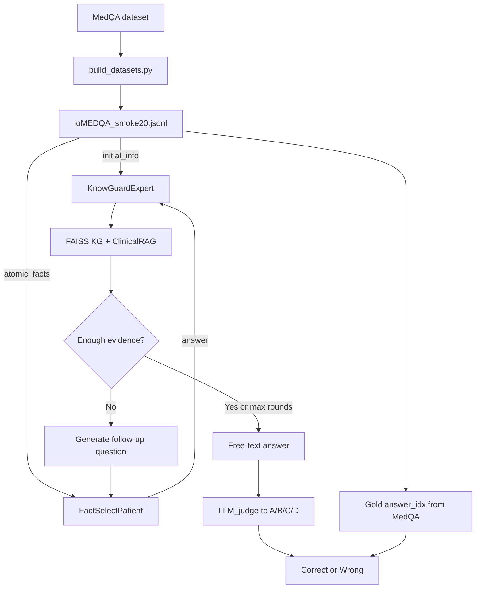

# KnowGuard Smoke20 Experiment Guide

Single reference for what this project is, where every file lives, what we take vs generate, how the flow works, and smoke20 results.

---

## 1. One-sentence summary

We run **multi-round clinical QA** with a doctor agent that **investigates external knowledge before answering** (KnowGuard). Cases and **gold answers** come from **MedQA**. Our system **generates** follow-up questions, patient replies, the predicted answer, and scores.

---

## 2. Workspace layout (where things are)

```
abs_task/
├── iclr_inspiration_paper.pdf          # Paper PDF (reference)
├── iclr_paper_text.txt                 # Paper text extract (reference)
└── KnowGuard/                          # Main implementation
    ├── EXPERIMENT_GUIDE.md             # THIS FILE
    ├── README.md
    ├── Open_benchmark.py               # Main eval loop (entry point)
    ├── expert.py                       # KnowGuardExpert / baselines
    ├── expert_functions.py             # Abstention + question generation
    ├── patient.py                      # FactSelectPatient
    ├── graph_reason.py                 # KG evidence discovery / scoring
    ├── clinical_rag.py                 # Textbook passage RAG
    ├── know_storage.py                 # FAISS KG load/init
    ├── LLM_judge.py                    # Free-text → option letter
    ├── args.py                         # CLI flags
    ├── data/
    │   ├── interactive/
    │   │   ├── ioMEDQA.jsonl           # Full 1272 cases
    │   │   ├── ioMEDQA_smoke20.jsonl   # Smoke20 used in this exp
    │   │   └── shards/                 # For full Ultra shard runs
    │   └── kg/
    │       ├── combined_primekg_hetionet.csv
    │       ├── faiss_db_combined/      # FAISS index used by smoke20
    │       ├── clinical_corpus/        # Clinical RAG passages
    │       └── WHO/
    ├── scripts/
    │   ├── build_datasets.py           # MedQA → ioMEDQA JSONL
    │   ├── run_smoke20_ultra.sh        # Launch smoke20 (background)
    │   ├── watch_smoke20_and_report.sh
    │   ├── report_smoke20_figures.py
    │   ├── compute_metrics.py
    │   └── run_ultra_only_serial.sh    # Full Ultra shard runner
    ├── results/
    │   ├── KnowGuardExpert_nemotron_ultra_smoke20.jsonl
    │   ├── KnowGuardExpert_nemotron_ultra_smoke20_metrics.json
    │   └── smoke20_figures/            # Reports for guide / paper-style I/O
    └── logs/
        └── smoke20_ultra.log           # Run log (if present)
```

---

## 3. What we take from elsewhere vs what we generate

### Taken from elsewhere (not invented by us)

| Item | Source | File / place |
|------|--------|----------------|
| Exam vignette, options A–D, **gold answer** | MedQA-USMLE validation | HuggingFace `GBaker/MedQA-USMLE-4-options-hf` → built into `data/interactive/ioMEDQA*.jsonl` |
| Knowledge graph edges/nodes | PrimeKG + Hetionet (public) | `data/kg/combined_primekg_hetionet.csv` + FAISS |
| Clinical textbook passages | Built corpus from MedQA contexts | `data/kg/clinical_corpus/` |
| LLM | NVIDIA NIM API | Model: `nvidia/nemotron-3-ultra-550b-a55b` |
| Embedding / rerank models | HuggingFace | MiniLM + cross-encoder |

### Built by our preprocessing (script, not the doctor agent)

| Item | How | File |
|------|-----|------|
| `ioMEDQA` interactive format | `scripts/build_datasets.py` | `data/interactive/ioMEDQA.jsonl` |
| `initial_info` | First sentence of vignette | inside each JSONL row |
| `atomic_facts` | Sentence-split vignette | inside each JSONL row |
| Smoke20 | First 20 rows | `data/interactive/ioMEDQA_smoke20.jsonl` |

### Generated by our system at run time

1. Doctor follow-up **questions** (each round)  
2. Patient **replies** (from `atomic_facts`)  
3. Abstain vs answer **decision**  
4. Retrieved **evidence** (which KG / RAG items were used)  
5. **Free-text** predicted answer  
6. Mapped **option letter** (`closest_option`) via judge  
7. **Metrics** and report markdown/CSV  

**Gold answer is never generated by us** — only compared against our prediction.

---

## 4. Where is the question? Where is the gold? Where is the prediction?

Example case `dev-00000`:

### Question (input) — in dataset

**File:** `KnowGuard/data/interactive/ioMEDQA_smoke20.jsonl`

| Field | Example |
|-------|---------|
| `initial_info` | “A 21-year-old sexually active male complains of fever…” |
| `question` | “What is the most likely diagnosis or correct answer?” |
| `options` | A Gentamicin, B Ciprofloxacin, **C Ceftriaxone**, D Trimethoprim |

### Gold answer — in dataset

| Field | Example |
|-------|---------|
| `answer` | Ceftriaxone |
| `answer_idx` | **C** |

Same values appear in results under `info.correct_answer` / `info.correct_answer_idx`.

### Our prediction — in results

**File:** `KnowGuard/results/KnowGuardExpert_nemotron_ultra_smoke20.jsonl`

| Field | Meaning |
|-------|---------|
| `interactive_system.questions[]` | Doctor questions we generated |
| `interactive_system.answers[]` | Patient replies we generated |
| `interactive_system.free_text_answer` | Free-text we generated |
| `interactive_system.closest_option` | Predicted letter (e.g. **C**) |

Score: predicted letter == gold letter → correct.

---

## 5. Flow diagram



### Same flow in plain words

1. Load case from MedQA-based JSONL (partial info to doctor; full facts hidden with patient).  
2. Doctor retrieves KG + clinical passages.  
3. If not enough → ask patient → append history → repeat.  
4. If enough (or hit max turns) → write free-text answer.  
5. Judge maps free text → A/B/C/D.  
6. Compare to MedQA gold letter → ACC / turns.

---

## 6. Architecture (code map)

| Paper idea | Our code |
|------------|----------|
| Patient agent | `patient.py` → `FactSelectPatient` |
| Doctor agent | `expert.py` → `KnowGuardExpert` |
| Evidence discovery | `graph_reason.py` (`InvestigationEngine`) + `clinical_rag.py` |
| Evidence evaluation | weights in `graph_reason.py` (sim, LLM relevance, coherence, decay, demo) |
| Abstention | `expert_functions.py` → `knowguard_abstention_decision_open` |
| Final mapping | `LLM_judge.py` → `compare_answer_to_options` |
| Eval loop | `Open_benchmark.py` |

---

## 7. Smoke20 experiment (what we ran)

| Setting | Value |
|---------|--------|
| Data | `ioMEDQA_smoke20.jsonl` (N=20) |
| Expert | `KnowGuardExpert` |
| Patient | `FactSelectPatient` |
| Model | `nvidia/nemotron-3-ultra-550b-a55b` (NIM) |
| Extra | clinical RAG, phase routing, adjudicator, entropy gate |
| Launcher | `scripts/run_smoke20_ultra.sh` |

### Results

| Metric | Value |
|--------|------:|
| Accuracy | **60%** (12/20) |
| Avg turns | **10.85** |
| Timeouts | 0 |

**Metrics file:** `results/KnowGuardExpert_nemotron_ultra_smoke20_metrics.json`

### Figure-style reports

| File under `results/smoke20_figures/` | Content |
|--------------------------------------|---------|
| `architecture_io.md` | Short I/O + architecture |
| `round_qa_maps.md` | All 20 cases, per-round Q/A |
| `case_study.md` | One case walkthrough |
| `metrics.json` | ACC / turns |
| `acc_vs_length.csv` | ACC by conversation length |
| `confidence_vs_progress.csv` | Confidence vs progress |

---

## 8. How to explain to your guide (3 boxes)

**Box 1 — Question (from MedQA)**  
Patient vignette start + options A–D.

**Box 2 — How we get the answer (our system)**  
Investigate KG/RAG → ask until enough → free-text → map to letter.

**Box 3 — Answers**  
- **Predicted:** our `closest_option`  
- **Gold:** MedQA `answer_idx`  
- **Score:** match or not; smoke20 = 60%

---

## 9. How to re-run / regenerate reports

```bash
cd KnowGuard
bash scripts/run_smoke20_ultra.sh          # starts background eval
# after JSONL has 20 lines:
.venv/bin/python scripts/compute_metrics.py \
  results/KnowGuardExpert_nemotron_ultra_smoke20.jsonl \
  --output results/KnowGuardExpert_nemotron_ultra_smoke20_metrics.json
.venv/bin/python scripts/report_smoke20_figures.py \
  results/KnowGuardExpert_nemotron_ultra_smoke20.jsonl \
  --outdir results/smoke20_figures
```

---

## 10. Important caveats

- Smoke20 is a **sanity check**, not paper Table 1 (paper uses larger N / stronger KG setup).  
- Only **ioMEDQA** is in this repo (no AFRIMEDQA / CRAFT data here).  
- Some doctor questions in logs can be noisy (model “thinking” leaked into question text) — implementation issue to improve later.  
- Do **not** commit `.env` (API keys).

---

## 11. Quick “where is X?” cheat sheet

| Looking for | Path |
|-------------|------|
| Input questions + gold | `data/interactive/ioMEDQA_smoke20.jsonl` |
| Our predictions + round Q/A | `results/KnowGuardExpert_nemotron_ultra_smoke20.jsonl` |
| ACC / turns | `results/KnowGuardExpert_nemotron_ultra_smoke20_metrics.json` |
| Human-readable round maps | `results/smoke20_figures/round_qa_maps.md` |
| Case study | `results/smoke20_figures/case_study.md` |
| This full guide | `KnowGuard/EXPERIMENT_GUIDE.md` |
